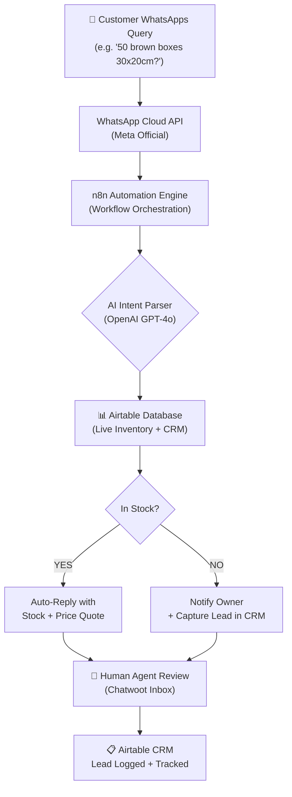

# GCC SME Automation: Market Research & GTM Dossier
### For: Product Space | Prepared By: Research Division
### Version: 2.0 | Date: May 2026

---

## Table of Contents
1. Executive Summary
2. Why This Market, Why Now
3. Industry Selection & Ranking
4. Market Sizing: TAM, SAM, SOM
5. Deep Dives: Top 3 Industries
6. User Personas
7. Competitive Landscape
8. Technology Stack & Scope of Work
9. Barriers to Entry from India & How to Overcome Them
10. Top 15 Target Accounts
11. Conclusion & Investment Justification

---

## 1. Executive Summary

The GCC's B2B wholesale sector — covering Auto Spare Parts, Packaging, and FMCG Distribution — is running on a dangerously outdated operational model. Billion-dollar industries are being managed through WhatsApp chats, physical godowns checked by eye, and invoices printed on paper.

This is not a problem of awareness. These business owners know they are losing leads and bleeding operational cost. The problem is **there is no solution that meets them where they are.** Enterprise ERPs are too expensive and too complex. Generic SaaS tools require internal IT teams they don't have. What this market desperately needs is a "Done-For-You" automation service that speaks the language of WhatsApp — because that is the platform they will never abandon.

**The opportunity:** A specialized automation agency from India can capture this whitespace by offering bespoke WhatsApp-native automation (inventory lookup, quoting bots, lead capture) at mid-market pricing. The GCC's SME sector — which represents over **94% of all businesses in the UAE** — is actively seeking this exact solution.

---

## 2. Why This Market, Why Now

### The Three Forces Creating This Window

#### Force 1: Government-Mandated Digital Pressure
The UAE government's Smart Dubai initiative, the National AI Strategy 2031, and the Electronic Invoicing System (EIS) mandate (penalties of AED 5,000/month for non-compliance from 2026) are forcing every business in the UAE to digitize their paper-based workflows. The government is *pushing* these SMEs toward technology. We are the ones who can *pull* them forward.
> *Source: UAE Ministry of Finance — EIS Mandate Announcement, 2024*

#### Force 2: The WhatsApp Economy is Already There
WhatsApp Business has over **2 billion users** globally, and in the GCC it is the primary platform for B2B commercial communication. A 2023 Meta study found that **over 60% of small business orders in the MENA region are placed via WhatsApp.** The B2B communication infrastructure is already there — it simply has no intelligence layered on top of it.
> *Source: Meta Business Insights MENA, 2023*

#### Force 3: The "Speed-to-Lead" Crisis
In Dubai's wholesale hubs (Deira, JAFZA, Sharjah Industrial), a buyer simultaneously WhatsApps 4-6 suppliers for the same product. The first supplier to reply with stock availability and price wins the order. If a business owner has to physically walk to his godown and count stock before replying, he loses. This is happening hundreds of times per day across the GCC. **The revenue lost to slow response is enormous and directly solvable.**

---

## 3. Industry Selection & Ranking

We evaluated 7 industries on two axes: **Profile Fit** (how closely they match the "WhatsApp-godown-Excel" profile) and **Automation Readiness** (how urgently they feel the pain and how willing they are to invest in a fix).

### Ranking Table

| Rank | Industry | Profile Fit | Automation Readiness | Est. UAE SOM |
|------|----------|-------------|----------------------|--------------|
| 🥇 1 | **Auto Spare Parts (Wholesale)** | ★★★★★ | ★★★★☆ | $1.5B |
| 🥈 2 | **Packaging Suppliers & Converters** | ★★★★★ | ★★★★★ | $2.5B |
| 🥉 3 | **Wholesale FMCG & Food Distributors** | ★★★★☆ | ★★★★☆ | $3.0B |
| 4 | Building Materials & Hardware | ★★★★☆ | ★★★☆☆ | $4.0B |
| 5 | Industrial Equipment (MEP/Electrical) | ★★★★☆ | ★★★★☆ | $0.5B |
| 6 | Textile Wholesale | ★★★★★ | ★★☆☆☆ | $2.0B |
| 7 | Furniture Manufacturing & Trading | ★★★☆☆ | ★★★☆☆ | $1.0B |

> **Why #4-7 are deprioritized:** Building materials have relationship-based pricing that resists automation. Textiles are hyper-visual and touch-driven — buyers need to feel fabric before ordering, limiting bot effectiveness. Furniture orders are bespoke and low-frequency.

---

## 4. Market Sizing: TAM, SAM, SOM

### Key Definitions
- **TAM** (Total Addressable Market): The entire GCC market for this industry.
- **SAM** (Serviceable Addressable Market): The UAE-specific portion of that market where our clients operate.
- **SOM** (Serviceable Obtainable Market): The SME segment within the UAE that is our actual target.

### Market Sizing Summary

| Industry | TAM (GCC) | SAM (UAE) | SOM (UAE SMEs) | Growth CAGR |
|----------|-----------|-----------|----------------|-------------|
| Auto Spare Parts | $11.7B | $7.3B | ~$1.5B | 4.1% |
| Packaging | $15.6B | $9.8B | ~$2.5B | 4.3% |
| FMCG Wholesale | $43B+ | $16B+ | ~$3.0B | 3.5% |
| **Combined SOM Target** | — | — | **~$7.0B** | — |

> *Sources:*
> - *Auto Parts: GMI Research GCC Automotive Aftermarket Report 2024 ($11.7B TAM), UAE Automotive Aftermarket valued at $7.3B — marknteladvisors.com*
> - *Packaging: GCC Packaging Market at $15.56B (thereportcubes.com), UAE Packaging at $9-10B (kenresearch.com), growth CAGR 4.3% (openpr.com)*
> - *FMCG/Wholesale: UAE wholesale food turnover exceeding AED 100B in 2023 (researchandmarkets.com), FMCG spend $48.6B (asercapital.ae)*

### Revenue Opportunity Visual

```
GCC Market Opportunity (TAM in USD Billions)
━━━━━━━━━━━━━━━━━━━━━━━━━━━━━━━━━━━━━━━━━━━━
Auto Spare Parts  ████████████░░░░░░░░░░  $11.7B
Packaging         ████████████████░░░░░░  $15.6B
FMCG Wholesale    ████████████████████░░  $43.0B+
━━━━━━━━━━━━━━━━━━━━━━━━━━━━━━━━━━━━━━━━━━━━
(Each block █ ≈ ~$2.5B)
```

### How We Size SOM (Our Realistic Target)
Our SOM is calculated as:
- UAE SMEs represent ~20-25% of total UAE industry revenue (based on UAE Ministry of Economy SME contribution data).
- Within that SME pool, we target those with 5-50 employees who cannot afford enterprise ERP but have enough revenue to justify a $3,000-$8,000 automation spend.
- Conservative estimate: 15-20% of UAE SME segment = **~$1-3B per industry.**

---

## 5. Deep Dive: Top 3 Industries

---

### Industry 1: Auto Spare Parts (Wholesale & Aftermarket)

**Overview:**
The UAE is not just a market for auto parts — it is a **global re-export hub.** Parts are imported in bulk from Asia, stored in massive godowns in Sharjah and JAFZA, and re-exported to Africa, Eastern Europe, and South Asia. SME wholesalers in Deira manage 50,000+ SKUs and serve hundreds of garages, dealers, and re-exporters simultaneously.

**The Specific Pain:**
A garage in Ajman WhatsApps a parts dealer: *"Do you have a throttle body for a 2017 Nissan Sunny?"*
The dealer must:
1. Search his inventory in a physical notebook or Excel file.
2. Physically visit the godown to confirm.
3. Manually type back a price quote.

This process takes 15-30 minutes. By that time, three other dealers have already replied. **The order is lost.**

**Market Stats:**
- UAE Automotive Aftermarket: **$7.0–7.3B** (2024) — *Source: marknteladvisors.com, GMI Research*
- The used car market in the UAE is growing, driving aftermarket demand: UAE has **6.5M registered vehicles** — *Source: RTA Dubai Annual Report 2023*
- Digital e-commerce in auto parts is growing at **~8% annually** in the GCC, driven by buyers who want instant quotes — *Source: techsciresearch.com*

**Automation Fit: 9/10**
The query types (part number + vehicle make/model/year) are highly structured and repetitive. An n8n bot can match incoming WhatsApp messages to an Airtable inventory database and return availability + price in seconds.

---

### Industry 2: Packaging Suppliers & Converters

**Overview:**
The UAE packaging market is directly fueled by the explosion of e-commerce, cloud kitchens, and food delivery. Every carton box, brown paper bag, and bubble wrap roll sold to an Amazon fulfillment center or a Talabat kitchen flows through a B2B packaging supplier. These suppliers — Hotpack, Falcon Pack, and hundreds of SMEs below them — are drowning in B2B inquiries for custom sizes and volumes.

**The Specific Pain:**
A restaurant chain WhatsApps a packaging supplier: *"Need 5,000 units of white kraft paper bags, 30x20cm, can you quote?"*
The supplier must:
1. Check if that dimension is in stock or needs production.
2. Calculate pricing based on volume and material cost.
3. Manually type a quote back.

With 50-100 such queries per day, 3 staff members spend their entire day just manually quoting. **High-revenue orders slip through on weekends when no one monitors the WhatsApp.**

**Market Stats:**
- GCC Packaging Market: **$15.56B** (2025), growing to $22B+ by 2034 — *Source: thereportcubes.com*
- UAE Packaging Market: **$9–10B** (2024) — *Source: kenresearch.com, researchandmarkets.com*
- UAE Paper Packaging specifically: **$3.84B** (2024), CAGR 5.3% — *Source: grandviewresearch.com*
- UAE B2B e-commerce (of which packaging B2B is a part): **$2.5B** (2024) — *Source: kenresearch.com*
- E-commerce boom in UAE driving demand: UAE's online retail grew **20%+ YoY** in 2023 — *Source: blueweaveconsulting.com*

**Automation Fit: 10/10**
Packaging queries are the most structurally repetitive of any industry. Dimensions, material type, print/no-print, volume, and delivery timeline can all be captured via a structured WhatsApp bot flow. Pricing can be auto-calculated from an Airtable formula. **This is the industry where automation has the fastest, most visible ROI.**

---

### Industry 3: Wholesale FMCG & Food Distributors

**Overview:**
The UAE's FMCG distribution ecosystem is massive. Thousands of small warehouses ("cold stores" and "godowns") distribute to HORECA (Hotels, Restaurants, Cafes), small baqalas (corner grocery stores), and supermarkets. Orders are taken entirely on WhatsApp: *"Bhai, send 10 cartons of Lays, 5 cartons of Pepsi, 2 cases of Tom Yum noodles."* There is no order management system. Stock is eyeballed. Expiry tracking is a mental calculation.

**The Specific Pain:**
A distributor with 200 HORECA clients receives 150+ WhatsApp orders per day across 3-4 phones. There is no record of what was ordered, what was delivered, or what is outstanding. Returns are handled by memory. **One missed order from a hotel chain is worth $5,000-$20,000.**

**Market Stats:**
- UAE FMCG Market: **$48.6B** (end of 2024) — *Source: asercapital.ae*
- UAE Wholesale Food Turnover: **>AED 100B** (2023) — *Source: researchandmarkets.com, 6wresearch.com*
- UAE Wholesale Market CAGR: **3.5%** through 2030 — *Source: researchandmarkets.com*
- UAE consumer FMCG spend: **$2.1B** in Q3 2024 alone, up **6.4% YoY** — *Source: NielsenIQ UAE*
- SMEs represent **94% of all UAE businesses** — *Source: UAE Ministry of Economy*

**Automation Fit: 8/10**
The volume of orders is enormous, but individual queries are conversational and slightly less structured (free text orders). This requires AI (OpenAI intent parsing) on top of n8n to extract structured order data from casual Arabic-English messages. Slightly more complex to build, but the ROI (saving $10,000+ in missed orders per month) is extremely clear and easy to pitch.

---

## 6. User Personas

Understanding exactly who we are selling to is critical for crafting the right pitch.

---

### Persona A: "Tariq" — The Owner/MD

```
━━━━━━━━━━━━━━━━━━━━━━━━━━━━━━━━━━━━━━━━━━━
TARIQ, 45
Owner, Al Majid Auto Parts LLC, Deira, Dubai
Revenue: ~AED 15M/year | Team: 8 people
━━━━━━━━━━━━━━━━━━━━━━━━━━━━━━━━━━━━━━━━━━━
Frustrations:
  ✗ 3 staff spend 6 hrs/day just answering WhatsApp
  ✗ "We lost a big order last Friday because it
    was a holiday and no one was checking messages"
  ✗ His Excel inventory file has 40,000 rows and
    nobody except him knows how to use it

Goals:
  ✓ Wants to stop losing weekend/holiday orders
  ✓ Wants someone to run his sales floor digitally
  ✓ Does NOT want to learn complex software himself

What He Will Pay For:
  A solution where he says "set it up and make it work"
  and never has to touch a computer for order tracking.

How to Reach Him:
  Direct WhatsApp. He checks his phone 200x a day.
  A video showing his own product line in a demo bot
  will close this deal in under 3 days.
━━━━━━━━━━━━━━━━━━━━━━━━━━━━━━━━━━━━━━━━━━━
```

---

### Persona B: "Ravi" — The Operations Manager (Son/Nephew, 2nd Generation)

```
━━━━━━━━━━━━━━━━━━━━━━━━━━━━━━━━━━━━━━━━━━━
RAVI, 28
Operations Manager, Hotpack MENA (SME division)
MBA graduate, LinkedIn active, tech-savvy
━━━━━━━━━━━━━━━━━━━━━━━━━━━━━━━━━━━━━━━━━━━
Frustrations:
  ✗ His father still uses a physical ledger for
    stock counts. He knows the company is bleeding.
  ✗ He has tried Wati (SaaS) but couldn't
    customize it to integrate with their ERP data
  ✗ He wants to show results quickly to prove
    to his father that he can modernize the business

Goals:
  ✓ Wants a professional implementation partner
  ✓ Wants to see ROI within 90 days to justify it
    internally to ownership
  ✓ Wants data: reports, dashboards, lead counts

How to Reach Him:
  LinkedIn InMail. Case study + ROI calculator.
  He will become the internal champion who sells
  this upward to his father/boss.
━━━━━━━━━━━━━━━━━━━━━━━━━━━━━━━━━━━━━━━━━━━
```

---

## 7. Competitive Landscape

### Who Else Is Solving This Problem?

```
Market Positioning Map

HIGH COST
    │
    │   [Prism Digital]  [NaulX]
    │        (AED 50k+)
    │
    │              ← OUR TARGET ZONE →
    │              [Done-For-You, Bespoke,
    │               Mid-Market: $3k-$8k]
    │
    │   [Wati SaaS]  [Rasayel SaaS]
    │   ($69-$350/mo, DIY, no implementation)
    │
LOW COST
    └─────────────────────────────────────
         Low Custom.         High Custom.
```

### Competitor Detail

| Competitor | Type | Target Client | Setup Price | Monthly Cost | Key Weakness |
|---|---|---|---|---|---|
| **Prism Digital** (UAE) | Full Agency | Enterprise (AED 5M+ revenue) | AED 50,000–200,000 | Custom retainer | Overkill & overpriced for SMEs |
| **NaulX** (Dubai) | n8n Specialist | Mid-market IT companies | AED 5,000–50,000 | AED 2,000–5,000 | No WhatsApp-native focus; no inventory integration |
| **Octopus Marketing** (UAE) | Marketing Agency | Retail & e-commerce | AED 3,000–15,000 | AED 1,000–3,000 | Focuses on marketing campaigns, not ops automation |
| **Wati** (Global SaaS) | DIY SaaS | Any business | $0 setup | $69–349/mo | No custom inventory integration; requires internal IT |
| **Rasayel** (UAE SaaS) | DIY SaaS | SME to Enterprise | $0 setup | $150–2,000/mo | Very expensive at scale; no bespoke implementation |

### The Whitespace We Are Targeting
No competitor in this market is offering:
1. A **Done-For-You** (zero IT burden on the client) service
2. That is specifically designed for **B2B inventory-based** WhatsApp automation
3. At a **mid-market price point** ($3,000–$8,000 setup)
4. With **ongoing managed support** included

This is the whitespace. **We are not competing with Wati or Prism. We are building a new category.**

---

## 8. Technology Stack & Scope of Work

### The Architecture



### Scope of Work Per Engagement

**Phase 1 — WhatsApp Auto-Responder (Month 1)**
- Meta Business Manager verification & WhatsApp Cloud API setup
- n8n workflow: dynamic menu builder + free-text intent parsing
- Airtable inventory database setup (migration from client's Excel)
- Chatwoot shared inbox for human agent handoff
- Staff training & documentation

**Phase 2 — Lead Generation Pipeline (Month 2-3)**
- Apify scraper setup: Google Maps, LinkedIn, industry directories
- Lead enrichment: company size, contact name, email/WhatsApp
- Automated outreach sequences via n8n
- Lead scoring and Airtable CRM logging

**Phase 3 — Ongoing Intelligence (Month 3+)**
- Monthly reporting: response rates, lead conversions, inventory turnover
- Bot optimization based on real conversation data
- Expansion: broadcast messaging to existing customers

---

## 9. Barriers to Entry from India & How to Overcome Them

This section addresses the most common objection head-on: *"Can we actually close clients 3,000km away from Mumbai or Bangalore?"*

**Answer: Yes. Here is the exact playbook.**

### Barrier 1: The "Spam Perception" — They Think We Are Generic Offshore Dev

**Why it happens:** GCC business owners receive hundreds of cold emails from Indian agencies promising "cheap websites" and "24/7 support." Their spam radar is highly tuned.

**The Fix:**
- Do NOT position as a software agency. Position as a **"GCC Wholesale Operations Specialist."**
- First touchpoint should be a **personalized Loom video** (2 minutes) showing a working WhatsApp bot with their specific product category (e.g., a bot responding to "Do you have 10mm x 20m PVC pipes in stock?" for a hardware dealer). This costs nothing to produce and is impossible to ignore.
- Use a localized domain (`.ae`) and a **+971 virtual phone number** (UAE country code, obtained for ~$10/month via Twilio). This is a UAE number that you operate from India — when a prospect sees a +971 number on WhatsApp, they perceive a local company. This removes the "offshore" label instantly.

> **What is a +971 number?** +971 is the international dialing code for the United Arab Emirates. Any call or WhatsApp sent from a number starting with +971 appears to recipients as a UAE-based contact. Services like Twilio, MessageBird, or Vonage allow you to purchase UAE virtual numbers and forward them to any Indian SIM. It is 100% legal and widely used.

### Barrier 2: The "Handshake Culture" — They Want to Meet Before Paying

**Why it happens:** Traditional GCC business culture is built on trust and personal relationships. Large purchases are made after a chai/coffee meeting, not a Zoom call.

**The Fix:**
- Offer a **free Proof of Concept (PoC)** before any contract. Build a working demo of their WhatsApp bot in 48 hours using dummy data. Let them test it on their own phone. A Zoom call where a prospect can WhatsApp "Do you have item X?" and see an instant reply from their own inventory data is more convincing than any sales deck.
- Have a **UAE-based referral partner** or freelancer who can attend a single in-person "kickoff" meeting for a commission. UAE has a large Indian diaspora community (3.5M Indians in UAE) who can act as local representatives.

### Barrier 3: Data Privacy & Hosting Concerns

**Why it happens:** GCC businesses — especially those in JAFZA (free zones) — may have concerns about customer data leaving UAE servers.

**The Fix:**
- Offer to host the n8n instance and Airtable data on **AWS `me-south-1` (Bahrain region)** — this is Amazon's dedicated Middle East server cluster. All data stays within the GCC.
- This is also a premium upsell: "We host everything in the UAE so your customer data never leaves the region — GDPR and UAE PDPL compliant."

### Barrier 4: Payment Complexity

**Why it happens:** International bank transfers from UAE to India have compliance overhead. Some clients may not want to deal with SWIFT fees or foreign exchange.

**The Fix:**
- Accept payment via **Wise Business** (formerly TransferWise), which handles AED → INR conversions seamlessly with low fees.
- Structure contracts in USD to avoid currency fluctuation issues for the client.
- Offer a **quarterly retainer** rather than monthly to reduce the administrative burden of repeated international transactions.

### Barrier Summary

| Barrier | Impact | Solution | Effort |
|---------|--------|----------|--------|
| Spam perception | High | Personalized Loom video + +971 virtual number | Low |
| Handshake culture | Medium | Free PoC demo on their own phone | Medium |
| Data residency | Medium | AWS `me-south-1` hosting option | Low |
| Payment complexity | Low | Wise Business, USD contracts, quarterly billing | Low |

---

## 10. Top 15 Target Accounts

These are real, verifiable companies in the GCC that precisely match our "Tariq" or "Ravi" persona. Large enough to have clear pain, small enough to move quickly.

### Auto Spare Parts

| # | Company | City | Est. Revenue | Why Target? |
|---|---------|------|-------------|-------------|
| 1 | **Rolman World** | Dubai (JAFZA) | $150M+ | Major bearings/parts wholesaler, massive SKU count, re-export focused |
| 2 | **A-Map (Al Muqarram)** | Dubai | $100M+ | Global aftermarket exporter; high B2B query volume |
| 3 | **Dynatrade** | UAE | $100M+ | Largest multi-brand parts network; multiple locations = complex inventory |
| 4 | **Ghassan Aboud Spare Parts** | UAE / Global | $200M+ | One of the largest automotive supply chain companies in the region |
| 5 | **Blue Star Auto Parts** | Sharjah | $50M+ | High local B2B distribution; WhatsApp-heavy sales culture |

### Packaging Suppliers

| # | Company | City | Est. Revenue | Why Target? |
|---|---------|------|-------------|-------------|
| 6 | **Hotpack Global** | UAE (Abu Dhabi) | $250M+ | Massive food packaging supplier; sells to 10,000+ B2B clients |
| 7 | **Falcon Pack** | Sharjah | $150M+ | Leading disposable packaging distributor; heavy WhatsApp ordering |
| 8 | **Amber Packaging** | UAE | $75M+ | Flexible packaging for FMCG; growing e-commerce client base |
| 9 | **ENPI Group** | UAE | $300M+ | Broad-line packaging; multiple SME subsidiaries ripe for automation |
| 10 | **Napco National** | KSA / UAE | $1B+ | Large scale but operates via localized B2B sales reps |

### FMCG & Food Wholesale

| # | Company | City | Est. Revenue | Why Target? |
|---|---------|------|-------------|-------------|
| 11 | **Baqer Mohebi (BME)** | UAE | $400M+ | Distributes massive volume to HORECA; WhatsApp-driven order flow |
| 12 | **Truebell Marketing** | UAE | $250M+ | Premium F&B and hospitality supplier; high-value but manual operations |
| 13 | **Jaleel Holdings** | UAE | $300M+ | Specialized wholesale for supermarkets; complex multi-SKU orders |
| 14 | **Gulfco** | UAE | $100M+ | Agile FMCG distributor; small enough to move fast on automation |
| 15 | **Al Sunbulah Group** | KSA | $500M+ | Major food distributor across KSA; expanding UAE operations |

---

## 11. Conclusion & Investment Justification

### Why Should You Spend Money Going After This Market?

The financial case is straightforward. One client in this segment, paying a $5,000 setup fee and a $300/month retainer, pays back the cost of acquiring them within **3-4 weeks of launch.**

Consider the math:
- The total setup cost of our automation service (n8n, Airtable, Chatwoot, API credits): **~$200-400/month** infrastructure cost to *us.*
- Client retainer: **$300-600/month** to the client.
- Margin per client: **$100-400/month.**
- With 10 clients running: **$1,000-$4,000/month pure margin**, plus the one-time setup fees.

More importantly, the **barrier to switch away is high.** Once we have migrated a client's inventory to Airtable and trained their staff on the WhatsApp bot, leaving means rebuilding everything from scratch. This is a sticky, recurring revenue model.

The GCC's $70B+ addressable B2B wholesale market is not shrinking — it is being forced to digitize by regulation and competition. The companies that get our solution first will outperform their competitors. That urgency is our greatest sales tool.

**The window to capture this whitespace is now. The market is mature enough to have the pain, and early enough that no dominant solution has emerged.**

---

*All market data sourced from: GMI Research, TechSci Research, marknteladvisors.com, kenresearch.com, thereportcubes.com, grandviewresearch.com, asercapital.ae, NielsenIQ UAE FMCG Report Q3 2024, Meta Business Insights MENA 2023, UAE Ministry of Economy SME Report 2024, researchandmarkets.com.*
