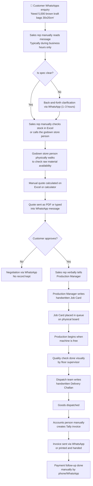
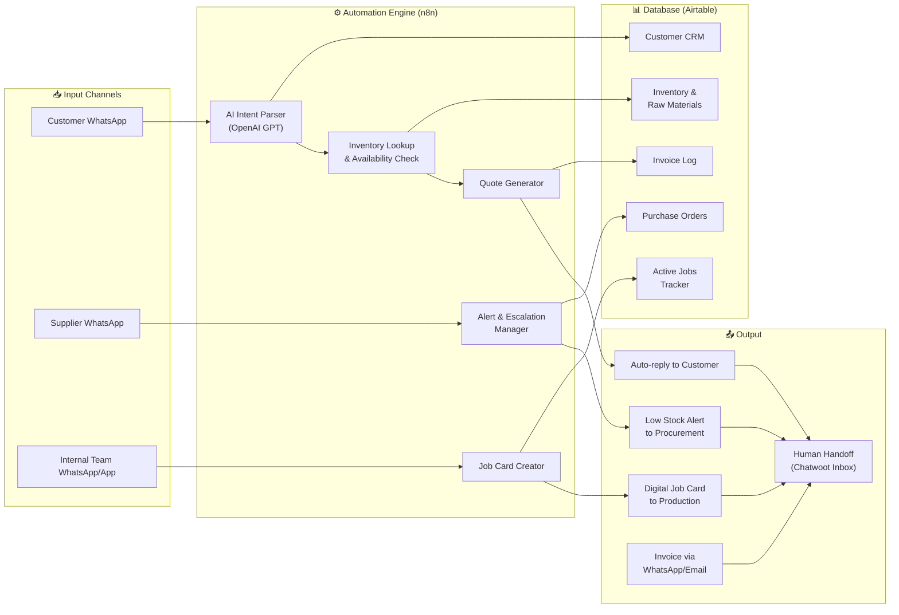

# Packaging Industry: Pilot Research Dossier
### Deep Dive: Operations, Paperless Challenges & IT Solution Blueprint
**Prepared for:** Product Space | **Date:** May 2026 | **Version:** 1.0

---

## Table of Contents
1. Overview: The Packaging SME in the GCC
2. Chapter 1: How Mid-Sized Packaging Companies Actually Operate Today
3. Chapter 2: The Paperless Crisis — Where Paper Is Costing Them Money
4. Chapter 3: The IT Solution Blueprint — What to Build & Why
5. Regulatory Pressure: The Compliance Tailwind
6. The Existing Software Landscape & Why It Fails SMEs
7. Our Solution Positioning

---

## Overview: The Packaging SME in the GCC

A mid-sized packaging company in the UAE — typically 15 to 80 employees, annual revenue between AED 5M and AED 50M — sits at a dangerous crossroads. Their business has grown significantly on the back of the UAE's booming e-commerce, food delivery, and hospitality sectors. But their **operations have not grown with them.** They are running a AED 20 million business on WhatsApp, Excel, and printed job cards.

This document dissects exactly how they operate, where their paper dependency is costing them, and what a purpose-built IT solution looks like for this profile.

---

## Chapter 1: How Mid-Sized Packaging Companies Actually Operate Today

### 1.1 Company Structure (Typical 25–60 Person Operation)

```
Owner / MD
    │
    ├── Sales Team (2–4 people)
    │       Handles enquiries, quotes, customer follow-ups
    │       Primary tool: WhatsApp Business, phone, Excel
    │
    ├── Production Manager (1 person + 10–30 floor workers)
    │       Manages job scheduling, machine operation, QC
    │       Primary tool: Printed job cards, whiteboard
    │
    ├── Procurement / Store (1–2 people)
    │       Manages raw material ordering, godown stock
    │       Primary tool: Excel, printed purchase orders
    │
    ├── Accounts / Finance (1 Tally person)
    │       Handles invoicing, receivables, VAT filing
    │       Primary tool: Tally ERP, manual invoices
    │
    └── Logistics / Dispatch (1–2 people)
            Coordinates delivery, generates delivery notes
            Primary tool: Handwritten challan books
```

### 1.2 The Full Order-to-Delivery Journey (As It Happens Today)

This is the lifecycle of a single customer order in a typical GCC packaging SME — mapped step by step, showing exactly where the process breaks down.



### 1.3 Raw Material & Inventory Management

**What they track (or try to):**
- Paper rolls (various GSM, width, type: kraft, coated, corrugated)
- Inks and printing supplies
- Adhesives, laminates, and films
- Finished goods awaiting delivery
- Partially used rolls from previous jobs (offcuts)

**How they actually track it:**
- A single Excel file, usually maintained by one store person
- Physical counting done by walking the godown — called "eyeballing"
- No barcode scanning, no real-time update when stock is consumed in production
- Partially used paper rolls often go untracked, leading to double-purchasing
- The Excel file is frequently out of date by 1–3 days

**What goes wrong:**
- Emergency raw material purchases at higher spot prices because reorder was missed
- Partially used rolls sit in godown uncounted; new rolls are ordered unnecessarily
- Production starts and then discovers mid-job that a specific ink or substrate is out of stock
- Working capital is tied up in excess inventory that isn't visible on any system

### 1.4 Production Planning

**Current method:** Whiteboards, paper job cards, and the Production Manager's memory.

A mid-sized packaging company with 3–5 machines may run 15–30 jobs simultaneously at different stages. Without a digital scheduling system:
- Jobs are prioritized by the loudness of the salesperson, not urgency or margin
- Machine changeover time is not factored in, leading to scheduling conflicts
- Last-minute rush orders (which are very common in packaging) disrupt the entire queue
- There is no visibility for the sales team on when a customer's order will be ready

### 1.5 Customer Communication Lifecycle

**Typical channels used (in order of frequency):**
1. WhatsApp Business (primary — used for everything)
2. Phone calls (for urgent follow-ups)
3. Email (only for large or formal clients who request it)
4. In-person visits (for new customers or large orders)

**Key friction points documented:**
- Customers query 3–5 suppliers simultaneously via WhatsApp; first to reply wins the order
- Response time during non-business hours (evenings, weekends, Ramadan hours) = zero, meaning all after-hours leads are permanently lost
- Proof approvals for custom print jobs happen via WhatsApp photo sharing — no version control, approvals easily missed or disputed
- No customer database exists; a departing salesperson takes all customer contact history with them (in their personal WhatsApp)

---

## Chapter 2: The Paperless Crisis — Where Paper Is Costing Them Money

### 2.1 The 8 Paper Workflows That Are Killing Efficiency

| Paper Document | Used For | What Goes Wrong When It's Paper |
|---|---|---|
| **Job Card** | Instructions from sales to production | Lost, illegible, outdated version used; spec errors on the floor |
| **Purchase Order (PO)** | Ordering from suppliers | No tracking, duplicate POs raised, no confirmation loop |
| **Delivery Challan** | Proof of goods dispatched | Lost in transit, disputes over quantities, no digital copy |
| **Goods Receipt Note (GRN)** | Confirming stock received from supplier | Never reconciled against PO; supplier overcharges go unnoticed |
| **Production Sheet** | Daily output tracking per machine | Not reconciled with job cards; waste/scrap not measured |
| **Quality Checklist** | Inspection sign-off before dispatch | Filled retroactively; quality issues missed until customer complains |
| **Artwork Approval Form** | Customer sign-off on print design | Done over WhatsApp; "I approved the old design" disputes common |
| **Quotation Register** | Log of quotes sent to customers | No tracking of quote-to-order conversion; follow-ups missed |

### 2.2 Specific Cost Impacts (Research-Validated)

#### Lost Sales from Slow Response
- UAE customers expect responses within **5–30 minutes** on WhatsApp or they move to the next supplier
- A packaging SME with 50 WhatsApp enquiries per day and a 30% after-hours rate loses ~15 leads daily to slow response
- At an average order value of AED 2,000–5,000, that is **AED 30,000–75,000 in lost revenue per day** from response gaps alone

> *Source: Industry data on UAE B2B WhatsApp expectations — saylsolutions.com, reddit UAE business communities*

#### Version Control Errors on Print Jobs
- When artwork approvals happen via WhatsApp image sharing, an outdated proof being approved is common
- A printing error on 5,000 custom boxes (due to wrong artwork version) typically means scrapping and reprinting the entire job
- Cost of a reprint mistake: **AED 3,000–15,000** per incident, plus customer relationship damage

> *Source: resco.net on version control in manufacturing, diracinc.com on packaging QC failures*

#### Invisible Inventory = Excess Capital Lock-up
- Without real-time inventory tracking, packaging companies typically carry **20–35% more raw material buffer stock** than necessary
- For a company spending AED 2M/year on raw materials, this means **AED 400,000–700,000 in unnecessarily tied-up working capital**

> *Source: sysgenpro.com inventory management analysis for packaging manufacturers*

#### Administrative Time Wasted on Paper Processing
- Studies across manufacturing SMEs show employees spend **2–3 hours per day** searching for, filing, and transporting paper documents
- For a 5-person office team, that is **10–15 person-hours per day** of zero-value activity
- At an average salary cost of AED 150/hour, this equals **AED 1,500–2,250 wasted per day** in administrative labour

> *Source: consentia.com, accesscorp.com on paperless transition ROI in manufacturing*

#### Compliance Risk from Paper Invoices
- From **July 1, 2027**, all UAE businesses must issue invoices in structured XML format (PINT-AE) via an Accredited Service Provider
- Penalty for non-compliance: **AED 100 per non-conforming invoice** + AED 5,000/month for not appointing an ASP
- A packaging company issuing 200 invoices/month that fails to comply faces AED 20,000–25,000/month in fines

> *Source: UAE Ministry of Finance — E-Invoicing Mandate 2026–2027*

### 2.3 The Hidden Data Problem

Paper-based operations don't just waste time — they destroy valuable business intelligence. A packaging company running on paper has **no answer** to the following questions without spending hours manually tallying records:

- Which customer generates the most revenue? Which generates the most disputes?
- Which product has the highest margin? Which is most frequently reordered?
- Which machine is most efficient? Which causes the most rework?
- What is the average quote-to-order conversion rate?
- Which raw material supplier has the best on-time delivery rate?

Without answers to these questions, the business cannot grow strategically. It is permanently reactive.

### 2.4 Regulatory Tailwind: The Government Is Pushing Them Toward You

Two major regulatory forces are actively creating urgency for GCC packaging companies to digitize:

**Force 1: UAE Electronic Invoicing Mandate**

| Milestone | Date | Requirement |
|---|---|---|
| Pilot / Voluntary Phase | July 1, 2026 | Companies can begin voluntary adoption |
| Large Businesses (>AED 50M revenue) | January 1, 2027 | **Mandatory** XML invoicing via Accredited Service Provider |
| All Other Businesses (<AED 50M revenue) | July 1, 2027 | **Mandatory** for all companies |
| Penalty for non-compliance | Ongoing | AED 100/invoice + AED 5,000/month |

Paper invoices will be **legally invalid** from 2027 onwards. This is not optional.

**Force 2: Extended Producer Responsibility (EPR) for Packaging**
- UAE's EPR framework (under the Circular Economy Policy 2021–2031) requires packaging producers to register with a Producer Responsibility Organisation (PRO) and **report detailed data** on packaging volumes, materials, and sustainability credentials
- Companies that cannot digitally track their packaging output will face compliance failures and financial penalties
- This drives urgent need for digital inventory and production tracking systems

> *Source: UAE Ministry of Finance E-Invoicing announcement, UAE Circular Economy Policy EPR Framework 2024*

---

## Chapter 3: The IT Solution Blueprint

### 3.1 The Core Principle: Meet Them Where They Are

The #1 mistake all existing software solutions make with GCC packaging SMEs: they ask the owner to change their behaviour. Wati asks them to log into a dashboard. Odoo asks them to learn a new ERP. Esko costs $50,000+.

**Our principle is the opposite: bring the intelligence to WhatsApp.** The owner will never stop using WhatsApp. The customer will never stop sending orders on WhatsApp. So we make WhatsApp smart.

### 3.2 The Five Modules of the Solution



### 3.3 Module Breakdown

#### Module 1: WhatsApp Auto-Responder & Lead Capture
**The Problem it solves:** Lost after-hours leads, slow response time, no customer database.

**How it works:**
- Customer messages the company's WhatsApp Business number
- Within 3 seconds, they receive a structured response with options (enquiry type, product category)
- Free-text messages (e.g., "I need 1,000 brown boxes 40x30x20cm") are parsed by AI to extract specifications
- The lead is automatically logged in the Airtable CRM with timestamp, product requirement, and customer details
- During business hours: alert sent to sales team via Chatwoot for human follow-up
- Outside business hours: customer gets an acknowledgment + expected callback time; lead is queued

**Business Impact:**
- Zero leads lost to slow response or after-hours gaps
- Every enquiry creates a customer record automatically
- Sales team wakes up to a structured queue, not a chaotic WhatsApp inbox

#### Module 2: Inventory Lookup & Availability Bot
**The Problem it solves:** Godown eyeballing, out-of-stock mid-production, emergency purchases.

**How it works:**
- When a customer enquiry arrives specifying a product, the bot checks the Airtable inventory database in real-time
- Returns: available stock, raw material status, and estimated production lead time
- When stock falls below a defined threshold, an automated WhatsApp alert is sent to the procurement person
- Raw material consumption is logged each time a Job Card is created, automatically reducing inventory count

**Business Impact:**
- Procurement team gets alerts before stockouts happen, not after
- Partially used rolls tracked digitally — no more invisible offcuts
- Eliminates emergency spot-purchase premium costs

#### Module 3: Digital Job Card & Production Queue
**The Problem it solves:** Handwritten job cards, scheduling conflicts, no production visibility for sales team.

**How it works:**
- When a customer order is confirmed, a digital Job Card is automatically created in Airtable
- Job Card contains: customer name, product specs, quantity, deadline, material required, machine assignment
- Production Manager sees a prioritized digital queue (accessible on any phone/tablet)
- Status updates (In Production → QC → Ready for Dispatch) are updated by floor supervisors via a simple WhatsApp command or web form
- Sales team can check order status in real-time — no more "Is my order ready?" calls

**Business Impact:**
- Production Manager has a real-time, prioritized queue instead of a physical whiteboard
- Sales team has live order status visibility
- All job history stored digitally for future reference and dispute resolution

#### Module 4: Automated Quotation Engine
**The Problem it solves:** Manual quote calculation, missed follow-ups, no quote tracking.

**How it works:**
- A pricing matrix is built in Airtable (product type × quantity × material = price)
- When a structured enquiry comes in (via WhatsApp bot or the sales team), the system auto-calculates a quote
- Quote is sent to the customer formatted professionally (with company branding via a PDF generator)
- Quote status is tracked: Sent → Opened → Approved / Rejected
- Automatic follow-up reminder sent to sales team if quote has not been responded to in 24–48 hours

**Business Impact:**
- Quotes generated in seconds instead of 20 minutes
- Every quote is tracked; no follow-up is ever missed
- Quote conversion rate becomes a measurable metric for the first time

#### Module 5: E-Invoice Generation & Compliance
**The Problem it solves:** Manual Tally invoicing, upcoming UAE e-invoicing mandate compliance.

**How it works:**
- When an order is marked "Dispatched" in the system, an invoice is automatically generated
- Invoice pulls data from the Job Card (customer details, items, quantity, price) — no manual re-entry
- Invoice is sent to customer via WhatsApp and/or email
- Invoice log maintained in Airtable with payment status tracking
- As UAE e-invoicing mandate approaches (2027), the system is designed to integrate with an Accredited Service Provider (ASP) for XML PINT-AE format output

**Business Impact:**
- Eliminates double data entry between production system and Tally
- Customer receives invoice immediately upon dispatch — faster payment cycles
- Compliance-ready architecture for 2027 mandate

---

## Chapter 4: The Existing Software Landscape & Why It Fails SMEs

### What Exists Today

| Software | Type | Best For | Pricing (Approx.) | Why SMEs Can't Use It |
|---|---|---|---|---|
| **Esko** | Prepress & Design | Large print/packaging enterprises | $20,000–$100,000+ | Way too expensive; requires specialist operators |
| **CERM** | Packaging MIS | Mid-to-large label & packaging converters | $15,000–$50,000 setup + SaaS | 3–6 month implementation; requires IT team |
| **Tharstern** | Print MIS | Print & packaging businesses | $10,000–$40,000 | Complex; requires training for every user |
| **Optimus** | Packaging MIS | Packaging-specific operations | Custom pricing | Not cloud-native; poor mobile experience |
| **Odoo** | Generic ERP | Any SME (not packaging-specific) | $2,000–$10,000 | Generic; needs heavy customization for packaging |
| **Wati** | WhatsApp SaaS | Any business using WhatsApp | $69–$349/month | No inventory integration; requires internal IT to build |
| **Rasayel** | WhatsApp SaaS | SME to Enterprise | $150–$2,000/month | No packaging-specific logic; expensive at scale |

> *Sources: CERM, Tharstern, Esko official websites; MIS vs ERP analysis — amtechsoftware.com*

### The Gap We Are Filling

**No solution on the market today offers:**
1. ✅ WhatsApp-native interface (no new app for the customer or the owner to learn)
2. ✅ Packaging-specific logic (custom dimensions, print specs, substrate types)
3. ✅ Live inventory integration with automated low-stock alerts
4. ✅ Digital job card and production queue on mobile
5. ✅ Auto-quotation with follow-up tracking
6. ✅ Mid-market pricing ($3,000–$8,000 setup, not $50,000)
7. ✅ 2–4 week implementation, not 6 months

This is the whitespace. **We are not replacing Esko or competing with Wati. We are building the layer between WhatsApp and their operations that nobody has built for this market.**

---

## Summary: The ROI Argument for the Client

When you walk into a GCC packaging company's office, present this:

| Pain Point | Monthly Cost Without Our Solution | Monthly Cost With Our Solution |
|---|---|---|
| Lost leads (after-hours & slow response) | AED 30,000–75,000 in lost revenue | AED 0 — 24/7 auto-response captures all enquiries |
| Administrative labour (paper filing) | AED 45,000–67,500 (15 hrs/day × AED 150) | Reduced by ~70% |
| Emergency raw material purchases | AED 10,000–30,000 | Reduced by ~80% with automated reorder alerts |
| Reprint errors (wrong artwork version) | AED 3,000–15,000 per incident | Near-zero with digital approval tracking |
| Future e-invoicing non-compliance fines | AED 20,000–25,000/month (from 2027) | AED 0 — system is compliance-ready |
| **Total Monthly Pain** | **AED 108,000–212,500** | **Reduced by 70–80%** |
| **Our Monthly Retainer** | — | **AED 1,000–2,500/month** |

**The ROI conversation is not "can you afford our solution." It is "can you afford not to have it."**

---

*Sources: sysgenpro.com, packiot.com, consentia.com, resco.net, diracinc.com, augmentir.com, esko.com, packaging-gateway.com, docuware.com, amtechsoftware.com, UAE Ministry of Finance E-Invoicing Mandate 2026, UAE EPR Circular Economy Policy 2021–2031, sleekflow.io, saylsolutions.com, NielsenIQ UAE FMCG Q3 2024, marknteladvisors.com*
